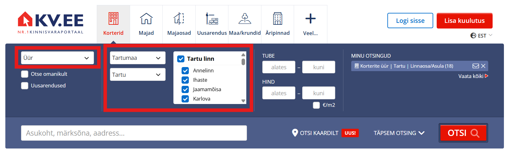
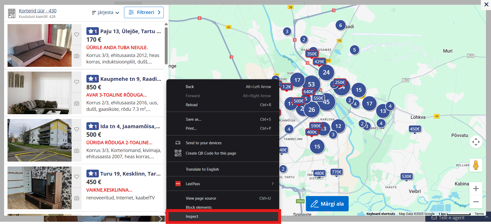
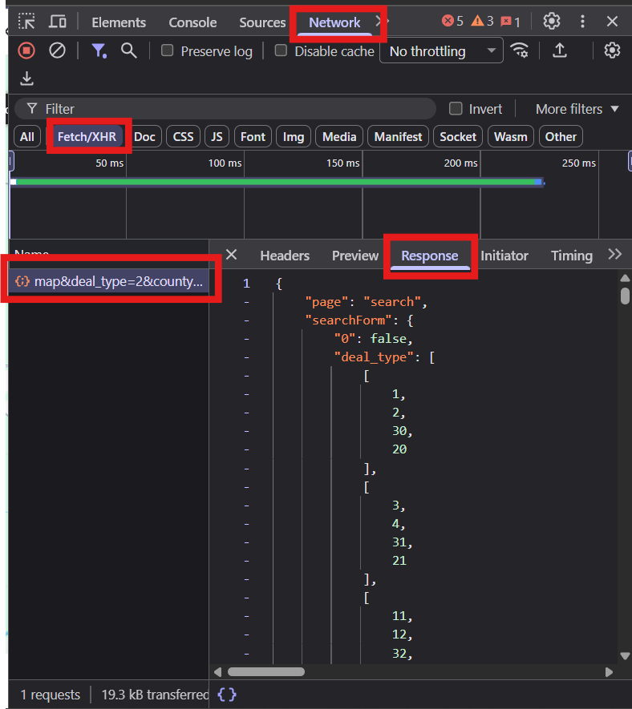

# Real Estate Pricerange Predictor

This project aims to set up a algorithm, that, when given a city's real estate data, can predict priceranges in any given xy coordinate within the citys boarders. This project was created in for a Tartu University CS class.

- [Real Estate Pricerange Predictor](Real-Estate-Pricerange-Predictor)
  - [Getting Started](Getting-Started)
    - [Scraping Data Example](Scraping-Data-Example)
      - [Manual Scraping](Manual-Scraping)
    - [Prerequisites](Prerequisites)

## Getting Started

This project uses data gathered from KV.ee specifically, but if youre willing to do your own data cleaning, other websites can be used as well.

### Scarping Data Example

Our data was scraped from KV.ee, the most popular real estate website in Estonia. The manual guide down below will work for all citys: the way the website is built, makes it hard to scrap data from smaller citys, since there are so many and each has their own id, which is very timeconsuming to gather up.

Note: We did try automating the scraping process with a script, but after some concideration (and some time fucking around and finding out) we decided to scrap the scrapper (see what I did there), since the websites api is blocking our requests for the data, thus making the script unethical use of brute force.

#### Manual Scraping

1. Go to KV.ee.
2. For type, choose rent (_Üür_), Then choose any city youd like to get data on.
   
3. Open "Search from the map" (_Otsi kaardilt_) and inspect the element.
   
4. From there, choose Network and Fetch/XHR. There you should see a line along the lines of "map&deal_type=2...". If there are multiple of them, choose the lowest, as it should be the latest. Click on it and then choose "Response".
   
5. Then just ctrl+A, ctrl+C and paste the whole thing into a .json file.

### Prerequisites

Requirements for the software and other tools to build, test and push

- [Example 1](https://www.example.com)
- [Example 2](https://www.example.com)

### Installing

A step by step series of examples that tell you how to get a development
environment running

Say what the step will be

    Give the example

And repeat

    until finished

End with an example of getting some data out of the system or using it
for a little demo

## Running the tests

Explain how to run the automated tests for this system

### Sample Tests

Explain what these tests test and why

    Give an example

### Style test

Checks if the best practices and the right coding style has been used.

    Give an example

## Deployment

Add additional notes to deploy this on a live system

## Built With

- [Contributor Covenant](https://www.contributor-covenant.org/) - Used
  for the Code of Conduct
- [Creative Commons](https://creativecommons.org/) - Used to choose
  the license

## Contributing

Please read [CONTRIBUTING.md](CONTRIBUTING.md) for details on our code
of conduct, and the process for submitting pull requests to us.

## Versioning

We use [Semantic Versioning](http://semver.org/) for versioning. For the versions
available, see the [tags on this
repository](https://github.com/PurpleBooth/a-good-readme-template/tags).

## Authors

- **Billie Thompson** - _Provided README Template_ -
  [PurpleBooth](https://github.com/PurpleBooth)

See also the list of
[contributors](https://github.com/PurpleBooth/a-good-readme-template/contributors)
who participated in this project.

## License

This project is licensed under the [CC0 1.0 Universal](LICENSE.md)
Creative Commons License - see the [LICENSE.md](LICENSE.md) file for
details

## Acknowledgments

- Daniel Henri Trump (Daniloom)
- Mari Lee Lumberg (lumbergmarilee)
- Karl Martin Puna (GnuThe2nd)
